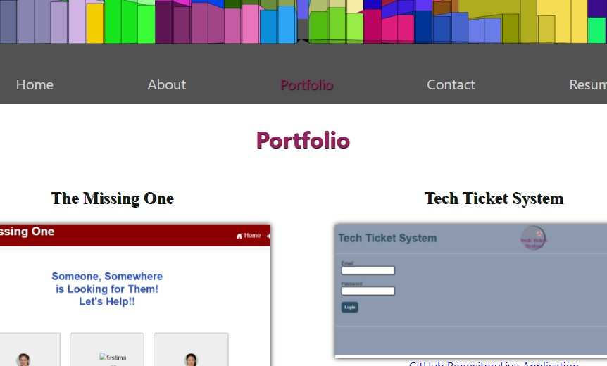

# Portfolio Revisited

  

  

  ## Description
  This project/application is a retooling of a portfolio website.  The prior portfolio applications that I created worked as intended but did not allow for users to acutally save messages.  This newest version of the portfolio site includes a database that stores messages posted.  This project is a MERN stack project; it uses Redux to store global state; it uses GraphQL to handle database interactions.
  
  ## Link
  tobeaddedlater
  
  ## Table of Contents
  
  * [Installation](#installation)
  * [Usage](#usage)
  * [License](#license)
  * [Contributing](#contributing)
  * [Tests](#tests)
  * [Questions](#questions)
  
  ## Installation
  
  To install a similar project, a user would need to clone the files in the application and run the appropriate npm install commands to install the necessary packages in both the client and server directories of the project.  The project utilizes certain environment variables, so a user would need to choose his/her own versions of such variables and include them in a .env file.
  
  ## Usage
  
  This is a portfolio project, and thus, there is not any true usage of the application beyond posting messages.
  
  ## License
  
  The content of this project is licensed under the [MIT License](https://opensource.org/licenses/MIT).  Please click [here](https://opensource.org/licenses/MIT) for more information about how you may use code in this project.

  ## Contributing

  I am not seeking specific contributions from developers on this particular project.
  
  
  ## Tests
  
  There were no structured test performed while building the application.  The only unofficial testing done was the standard console.log usage.
  
  ## Questions
  [GitHub Profile](http://github.com/cabralwilliams)
  
  For any questions concerning this application, please contact me at cabral.williams@gmail.com.